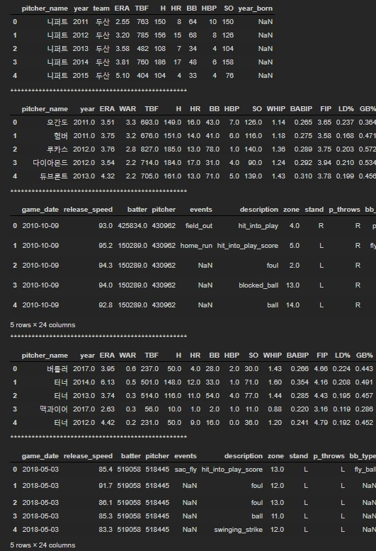
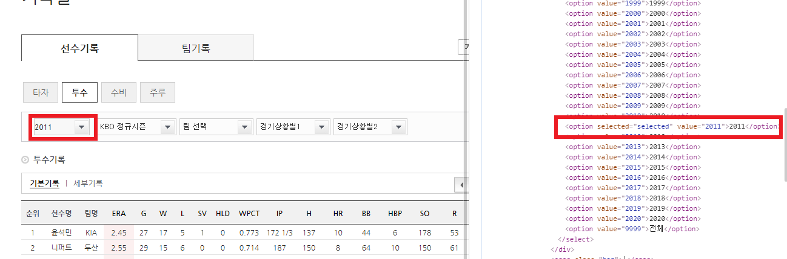
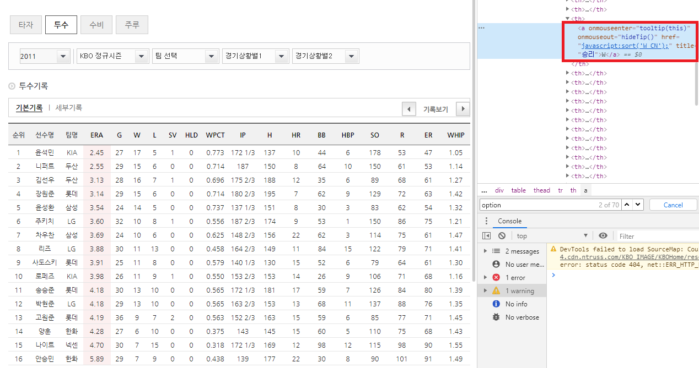
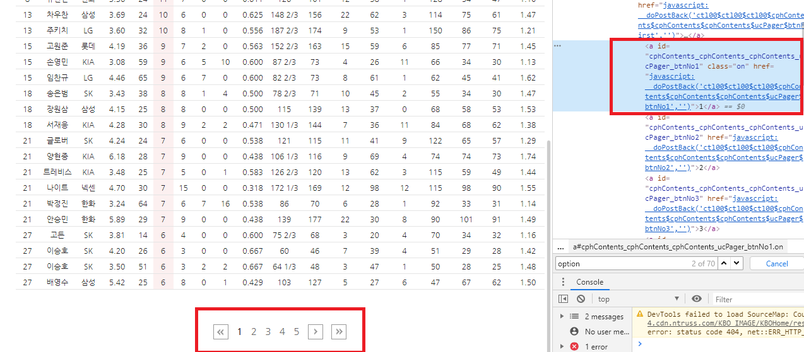
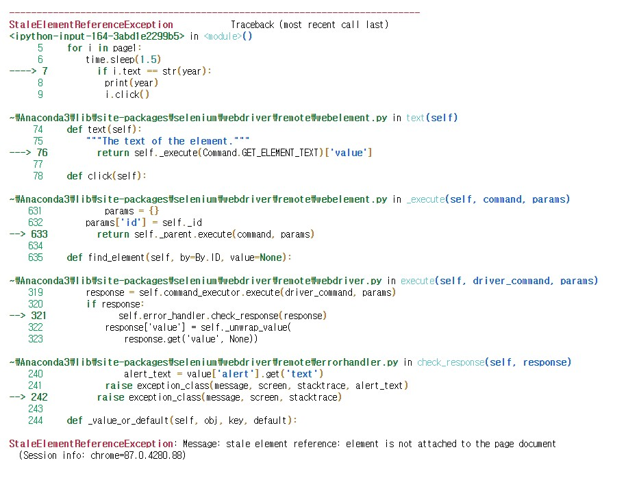
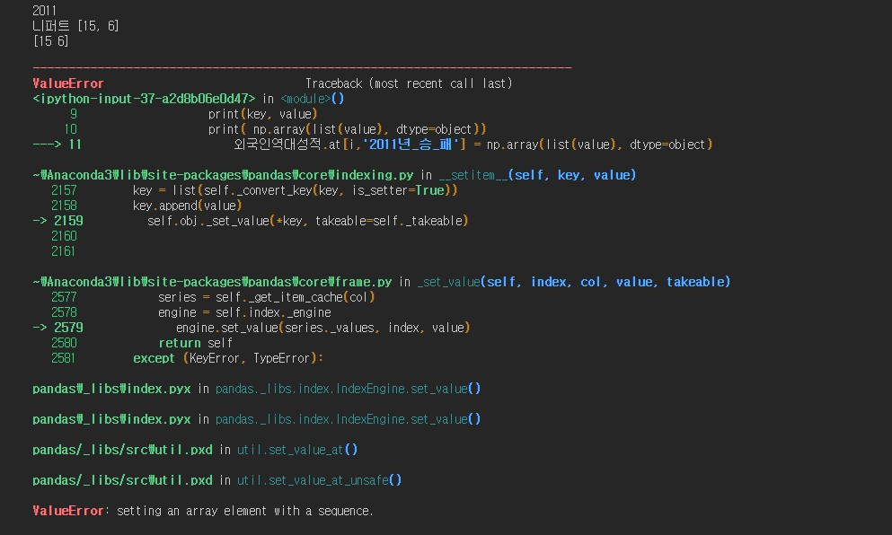
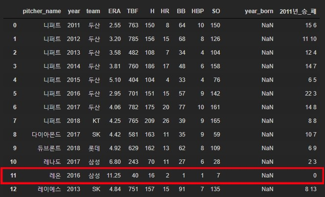
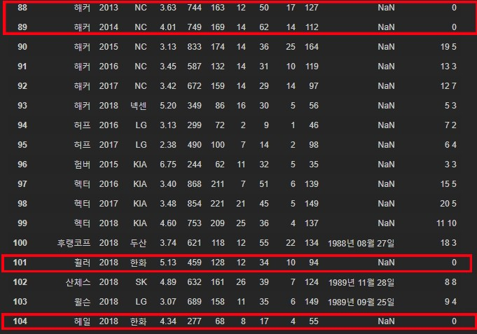
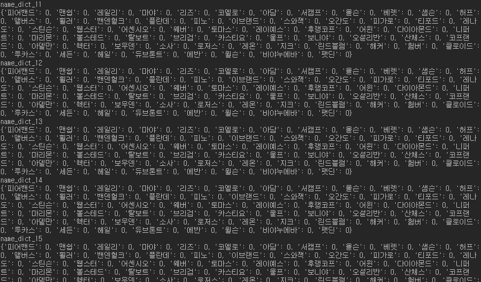

# 데이콘 - KBO 외국인 투수 스카우팅 최적화 경진대회 [연습]

### 데이터 불러오기

```python
import pandas as pd
```

```python
외국인역대성적 = pd.read_csv('kbo_yearly_foreigners_2011_2018.csv')
외국인메이저성적 = pd.read_csv('fangraphs_foreigners_2011_2018.csv')
외국인스탯캐스터 = pd.read_csv('baseball_savant_foreigners_2011_2018.csv')
신규외국인성적 = pd.read_csv('fangraphs_foreigners_2019.csv')
신규외국인스텟캐스터 = pd.read_csv('baseball_savant_foreigners_2019.csv')
```

### 파일 확인

```python
display(외국인역대성적.head())
print('*'*50)
display(외국인메이저성적.head())
print('*'*50)
display(외국인스탯캐스터.head())
print('*'*50)
display(신규외국인성적.head())
print('*'*50)
display(신규외국인스텟캐스터.head())
print('*'*50)
```



- 다음과 같이 파일이 어떤 구성으로 되어있는지 확인하였다.

### 승리와 패배 크롤링 하기

- 승리와 패배가 없어서 [기록실](https://www.koreabaseball.com/Record/Player/PitcherBasic/Basic1.aspx)에서 크롤링하기로 하였다.

```python
name = list(set(외국인역대성적['pitcher_name']))

name_dict = {}
for data in name:
    name_dict[data] = 0
```

- 우선 외국인 선수의 이름을 담은 리스트를 만들어서 각자 값을 담을 딕셔너리를 만든다.

#### 패키지 import

```python
from urllib.request import urlopen
from bs4 import BeautifulSoup
from urllib.request import urlopen
from urllib.error   import HTTPError
from urllib.error   import URLError

from selenium import webdriver
import time
path = '../driver/chromedriver.exe'
driver = webdriver.Chrome(path)
```

#### 크롤링 함수 

```python
driver.get('https://www.koreabaseball.com/Record/Player/PitcherBasic/Basic1.aspx')
page1 = driver.find_elements_by_tag_name('option')
for year in [ i for i in range(2011,2019)]:
    page1 = driver.find_elements_by_tag_name('option')
    for i in page1:
        if i.text == str(year):
            print(year)
            i.click()
            time.sleep(1.5)
            page = driver.find_elements_by_css_selector('.tData01')
            k = page[0].find_element_by_tag_name('thead').find_element_by_tag_name('tr').find_elements_by_tag_name('th')
            k[5].click()
            time.sleep(1.5)
            page3 = driver.find_elements_by_css_selector('.paging')
            for page_num in range(1,6):
                page3 = driver.find_elements_by_css_selector('.paging')
                page3[0].find_elements_by_tag_name('a')[page_num].click()
                time.sleep(1.5)
                page2 = driver.find_elements_by_css_selector('.tData01')
                a = page2[0].find_element_by_tag_name('tbody').find_elements_by_tag_name('tr')
                for idx,value in enumerate(a):
                    print(value.find_elements_by_tag_name('td')[1].text)
```



- 우선 연도를 클릭해야 해서 해당 태그를 찾아 option이랑 루프 구문이 같으면 클릭`i.click()`해서 해당 연도로 넘어가도록 하였다.



- 그 다음에 처음 화면은 제한된 선수만 보여줘서 W`k[5].click()`를 클릭하여 모든 선수를 볼 수 있도록 한다.


- 다음과 같이 정렬하도록 click()속성을 준다.



- 총 5페이지여서 `page3[0].find_elements_by_tag_name('a')[page_num].click()` 하여 페이지를 넘긴다.
- 다시 2012년도로 돌아갈 때 다음과 에러가 발생하였다.



- 그래서 함수로 만들어서 년도별로 저장하려고 한다.

### 에러 해결 후 다시 크롤링

```python
def player_win(year,dic):
    driver.get('https://www.koreabaseball.com/Record/Player/PitcherBasic/Basic1.aspx')
    page1 = driver.find_elements_by_tag_name('option')
    for i in page1:
            if i.text == str(year):
                print(year)
                i.click()
                time.sleep(1.5)
                page = driver.find_elements_by_css_selector('.tData01')
                k = page[0].find_element_by_tag_name('thead').find_element_by_tag_name('tr').find_elements_by_tag_name('th')
                k[5].click()
                time.sleep(1.5)
                page3 = driver.find_elements_by_css_selector('.paging')
                for page_num in range(1,6):
                    page3 = driver.find_elements_by_css_selector('.paging')
                    page3[0].find_elements_by_tag_name('a')[page_num].click()
                    time.sleep(1.5)
                    page2 = driver.find_elements_by_css_selector('.tData01')
                    a = page2[0].find_element_by_tag_name('tbody').find_elements_by_tag_name('tr')
                    for idx,value in enumerate(a):
                        name = value.find_elements_by_tag_name('td')[1].text
                        for key in list(dic.keys()):
                            if key == name:
                                print(name)
                                dic[key] = [value.find_elements_by_tag_name('td')[5].text, value.find_elements_by_tag_name('td')[6].text]
                break 
    return    dic   
```

- 크롤링 함수안에서 날짜를 잡으려고 하니 에러가 나서 우선 함수를 만들고 함수 바깥에서 for문을 돌려서 연도를 넘겨주기로 하였다. 그리고 break를 써서 에러나기전에 빠져나왔다.

### 연도별 dict 만들기

```python
name_dict_11 = {}
for data in name:
    name_dict_11[data] = 0

name_dict_12 = {}
for data in name:
    name_dict_12[data] = 0   
    
name_dict_13 = {}
for data in name:
    name_dict_13[data] = 0   
    
name_dict_14 = {}
for data in name:
    name_dict_14[data] = 0    
    
name_dict_15 = {}
for data in name:
    name_dict_15[data] = 0
    
name_dict_16 = {}
for data in name:
    name_dict_16[data] = 0
    
name_dict_17 = {}
for data in name:
    name_dict_17[data] = 0
    
name_dict_18 = {}
for data in name:
    name_dict_18[data] = 0  
```

- 2011 ~ 2018년도까지 딕셔너리를 만들어서 해당 투수의 승리와 패배를 리스트로 저장한다.

### 연도와 딕셔너리 이름 리스트 만들기

```python
dic_list = [name_dict_11, name_dict_12,name_dict_13,name_dict_14,name_dict_15,name_dict_16,name_dict_17,name_dict_18]
year_list = [i for i in range(2011,2019) ]
```

- for문 돌릴 때 필요한 리스트를 만들었다.

### 최종 함수 만들기와 저장

```python
def save(dic_list, year_list):
    for dic,year in zip(dic_list, year_list):
        print(dic)
        dic = player_win(year,dic)
        
save(dic_list, year_list)        
```

- 최종으로 함수를 만들었고 실행하였다.

### 크롤링 저장 결과

```python
name_dict_18
>
{'후랭코프': [18, 3],
 '험버': 0,
 '마야': 0,
 '레일리': [11, 13],
 '팻딘': [6, 7],
 '휠러': [3, 9],
 '브리검': [11, 7],
 '어센시오': 0,
 '이브랜드': 0,
 '아델만': [8, 12],
 '토마스': 0,
 '세든': 0,
 '린드블럼': [15, 4],
 '서캠프': 0,
 '윌슨': [9, 4],
 '비야누에바': 0,
 '에반': 0,
 '로저스': [5, 4],
 '루카스': 0,
 '마리몬': 0,
 '헤일': [3, 4],
 '해커': [5, 3],
 '레나도': 0,
 '레온': 0,
 '웨버': 0,
 '허프': 0,
 '웹스터': 0,
 '클로이드': 0,
 '보우덴': 0,
 '스와잭': 0,
 '코프랜드': 0,
 '피어밴드': [8, 8],
 '샘슨': [13, 8],
 '피가로': 0,
 '앨버스': 0,
 '베렛': [6, 10],
 '레이예스': 0,
 '리즈': 0,
 '스틴슨': 0,
 '볼스테드': 0,
 '플란데': 0,
 '올슨': 0,
 '맨쉽': 0,
 '밴덴헐크': 0,
 '보니야': [7, 10],
 '지크': 0,
 '아담': 0,
 '탈보트': 0,
 '오간도': 0,
 '카스티요': 0,
 '피노': 0,
 '헥터': [11, 10],
 '산체스': [8, 8],
 '코엘로': 0,
 '소사': [9, 9],
 '니퍼트': [8, 8],
 '티포드': 0,
 '오설리반': 0,
 '어윈': 0,
 '다이아몬드': 0,
 '울프': 0,
 '듀브론트': [6, 9]}
```

- 그럼 이렇게 해당 투수에 대한 정보가 저장된다. 이제 df와 합쳐서 분석하면 된다.

### 딕셔너리랑 df 합치기

```python
import numpy as np

for dic,year in zip(dic_list, year_list):
    for i in range(외국인역대성적.shape[0]):
        if 외국인역대성적.loc[i,'year'] == year:
            print(year)
            for key,value in dic.items():
                if 외국인역대성적.loc[i,'pitcher_name'] == key:
                    print(key, value)
                    print( np.array(list(value), dtype=object))
                    외국인역대성적.at[i,'2011년_승_패'] = np.array(list(value), dtype=object)
```

- 연도와 dict랑 비교해서 같은 년도에 같은 투수 이름이 있으면 해당 투수 컬럼에 저장하는 식으로 하였다. 
- 그러나 마지막 행에서 `setting an array element with a sequence.` 와 같은 오류가 발생하여 해결하려고 한다.



### df와 딕셔너리 합치기

```python
for dic,year in zip(dic_list, year_list):
    for i in range(외국인역대성적.shape[0]):
        if 외국인역대성적.loc[i,'year'] == year:
            print(year)
            for key,value in dic.items():
                if 외국인역대성적.loc[i,'pitcher_name'] == key:
                    if value != 0:
                        print(key, value)
                        print(value)
                        print(' '.join(value))
                        외국인역대성적.loc[i,'2011년_승_패'] = str(' '.join(value))
                    else:
                        외국인역대성적.loc[i,'2011년_승_패'] = 0
```

- value의 값이 0이 아니면 승과 패를 한 칸 띄어서 저장하였다.





- 이렇게 새로운 컬럼이 추가되었다. 
  - 그러나 빨간박스를 보면 출전기록은 있는데 승_패 값이 0인 경우가 있다. 기록실을 살펴보니 해당 선수의 기록이 없었다. 왜그런지 더 살펴보기로 하였다.

#### 연도별 dict 만들기 수정

```python
names=[]
def setName(cnt):
    global names
    for i in range (11,cnt+1):
        names.append('name_dict_{}'.format(i)) 
    for name1 in names:
        globals()[name1] = {}
        for i2 in name_list:
            globals()[name1][i2] = 0
        print(name1)    
        print(globals()[name1])       
setName(18)  
```

- 위에서는 하나씩 일일이 코딩했다면 for문을 돌려서 동적 변수로 딕셔너리를 만들었다.



```python
for i in names:
    print(eval(i).items())
    
>
dict_items([('피어밴드', 0), ('맨쉽', 0), ('레일리', 0), ('마야', 0), ('리즈', 0), ('코엘로', 0), ('아담', 0), ('서캠프', 0), ('올슨', 0), ('베렛', 0), ('샘슨', 0), ('허프', 0), ('앨버스', 0), ('휠러', 0), ('밴덴헐크', 0), ('플란데', 0), ('피노', 0), ('이브랜드', 0), ('스와잭', 0), ('오간도', 0), ('피가로', 0), ('티포드', 0), ('레나도', 0), ('스틴슨', 0), ('웹스터', 0), ('어센시오', 0), ('웨버', 0), ('토마스', 0), ('레이예스', 0), ('후랭코프', 0), ('어윈', 0), ('다이아몬드', 0), ('니퍼트', 0), ('마리몬', 0), ('볼스테드', 0), ('탈보트', 0), ('브리검', 0), ('카스티요', 0), ('울프', 0), ('보니야', 0), ('오설리반', 0), ('산체스', 0), ('코프랜드', 0), ('아델만', 0), ('헥터', 0), ('보우덴', 0), ('소사', 0), ('로저스', 0), ('레온', 0), ('지크', 0), ('린드블럼', 0), ('해커', 0), ('험버', 0), ('클로이드', 0), ('루카스', 0), ('세든', 0), ('헤일', 0), ('듀브론트', 0), ('에반', 0), ('윌슨', 0), ('비야누에바', 0), ('팻딘', 0)])
```

- 그 다음에 이렇게 eval()로 names에 저장된 딕셔너리 이름을 호출하면 정상적으로 만들어진 딕셔너리가 호출된다.

