# 데이콘 - KBO 외국인 투수 스카우팅 최적화 경진대회 [연습]_02

### 만들었던 csv 불러오기

```python
외국인역대성적 = pd.read_csv('kbo_yearly_foreigners_2011_2018_추가분.csv',encoding='utf-8-sig',engine='python',sep=',')
외국인역대성적.head()
```

- 지난번에 승_패를 저장했던 파일을 다시 불러온다.


- 그러면 이렇게 정상적으로 불러와진다. 현재 승,패가 같이 붙어있으니 따로 나눠서 승,패로 새로운 컬럼으로 넣어주자.

```python
외국인역대성적['승'] = 외국인역대성적['2011년_승_패'].apply(lambda x:str(x).split(' ')[0])
외국인역대성적['패'] = 외국인역대성적['2011년_승_패'].apply(lambda x:str(x).split(' ')[1])

외국인역대성적.drop('2011년_승_패',axis=1,inplace=True)
```

- 공백으로 나눠서 0번째는 승, 1번째가 패이다. 그 다음에 원래있던 2011\_승_패 컬럼을 제거했다.

- 그러면 승률과 경기수를 추가하자.

```python
def winratio(x):
    return round(int(x['승']) / (int(x['승'])+int(x['패'])),3)

외국인역대성적['승률'] = 외국인역대성적.apply(lambda x:winratio(x),axis=1)
외국인역대성적['경기수'] =  외국인역대성적.apply(lambda x:int(x['승']) + int(x['패']),axis=1)
```

- 이렇게 하면 승률과 관련된 정보들이 모였다.


#### 승률과 경기수로 상위 10명, 하위 10명 알아보기

```python
def headtail10(df,text):
    display(df.sort_values(text,ascending=False).head(10))
    print('*'*20,'head','*'*20)
    display(df.sort_values(text,ascending=False).tail(10))
```

```python
headtail10(외국인역대성적,['경기수','승률'])
```

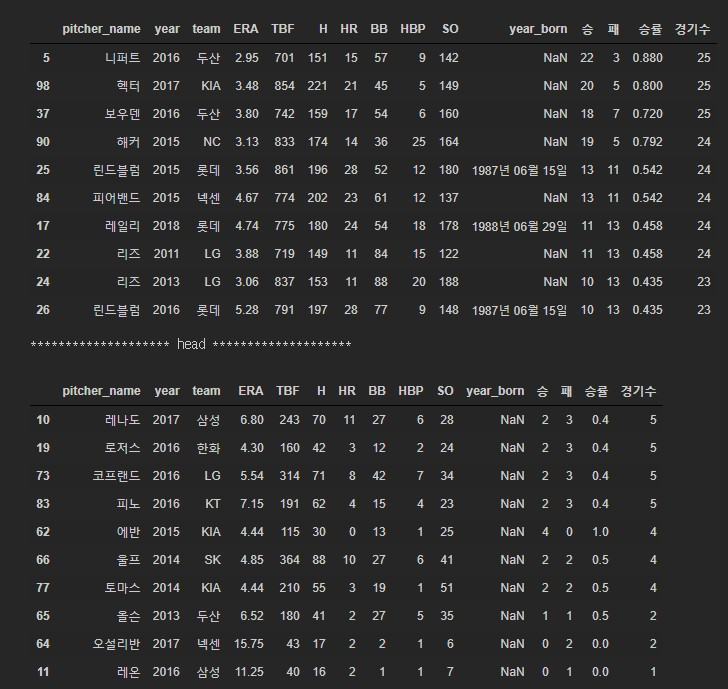 

- 경기수가 많다는건 팀에서 핵심 투수라는 건데 경기수가 낮은 투수들이 있었다. 경기수도 많으면서 승률이 높은 투수들의 특징이 무엇인지 분석하면 될 것 같다.

```python
headtail10(외국인역대성적,['승률','경기수'])
```

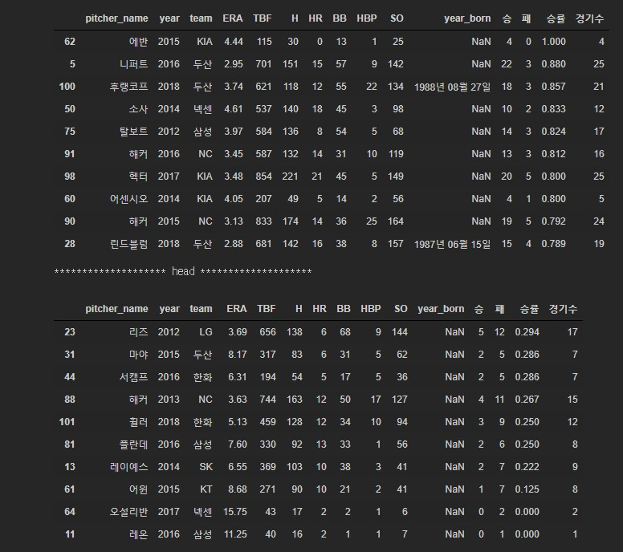

- 상위권은 위랑 비슷하지만 하위권이 다르다. 경기수는 많지만 승률이 낮은 투수들이 있었다. 이것도 비교하면 좋겠다.

```python
headtail10(외국인역대성적,['경기수'])
```

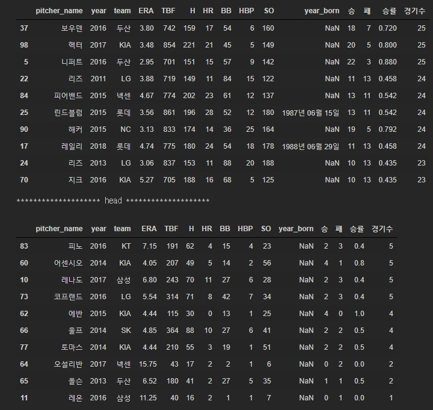

- 경기수가 적은 선수들이 과연 왜그럴까 생각해봤더니 방출가능성이 있었다. 그레서 방출된 선수들의 명단을 찾아서 정보를 날리기로 하였다. 방출된 선수들의 정보도 따로 보려고 한다.

#### 방출 선수 찾기

- [외국인선수목록](https://namu.wiki/w/%EC%99%B8%EA%B5%AD%EC%9D%B8%20%EC%84%A0%EC%88%98/%EC%97%AD%EB%8C%80%20%ED%94%84%EB%A1%9C%EC%95%BC%EA%B5%AC)
- 여기서 그냥 찾아서 엑셀에 기록하였다.


### 방출선수들 세부기록 보기

```python
throw_df = pd.read_csv('plus_win_lose_2.csv')
throw_df.head()
```

- 위에서 입력한 파일을 열었다.

```python
throw_df_01 =  throw_df[throw_df['방출연도'].isnull() == False].reset_index(drop=True)
throw_df_01['방출연도'] = throw_df_01['방출연도'].astype(int)
```

- 방출연도라는 새로운 컬럼을 위에서 만들었고 그 값이 null이 아닌 것들만 추려서 인덱스와 타입을 바꾸었다.

```python
throw_df_01.describe()
```

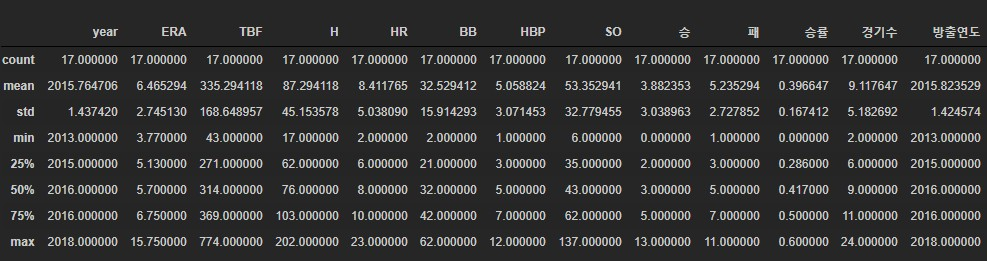

- 패한 경기수가 더 많다.
- era도 6.x대라 낮다고 볼 수 없다. 그러면 게임수로 나눠보자.

### 기록 용어 설명

| 용어이름 | 영문 풀이             | 한국용어           | 설명                                                         |
| -------- | --------------------- | ------------------ | ------------------------------------------------------------ |
| ERA      | Earned Run Average    | 평균자책점(방어율) | (9 × 자책점) ÷ 투구이닝<br>숫자가 낮을수록 좋으며 상대팀에게 얼마나 점수를 덜 주었는지 나타내는 지표 |
| TBF      | Total Batters Faced   | 타자수             | 투수가 경기 중에 상대한 모든 타자의 수                       |
| H        | Hits                  | 피안타             | 2루타, 3루타, 홈런을 포함 (각각 1개로 계산)                  |
| HR       | Home Runs             | 홈런               |                                                              |
| BB       | Bases on Balls, Walks | 볼넷               |                                                              |
| HBP      | Hit By Pitch          | 사구               | 몸에 맞는 볼                                                 |
| SO       | Strike Outs           | 삼진               |                                                              |

```python
throw_df_01[throw_df_01['경기수'] >= 10].describe()
```

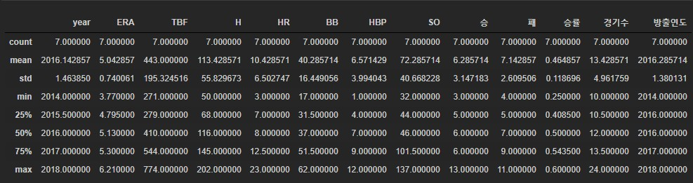

- 10경기 이상 뛴 선수로 나눈 것은 어느정도 괜찮은 성적을 내고있다고 생각해서 그만큼 경기를 뛰었다고 생각했기때문이다.
- 기대만큼 다들 못해줘서 방출이라는 결과가 나온것 같다. 세부기록들은 다른 방출 안 된 선수들과 비교해보자.

```python
throw_df_01[throw_df_01['경기수'] < 10].describe()
```

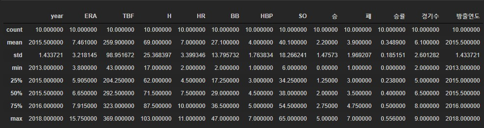

- 승률도 낮고 평균자책점도 높다. 

```python
throw_df[throw_df['pitcher_name'] == '마야']
```

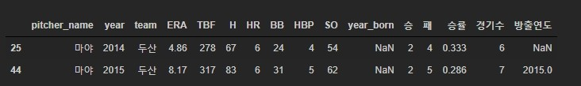

- 이렇게 2년간 뛰다가 방출된 선수들도 있어서 비고해보기로 하였다. 확실히 2015년에 기록이 안좋아졌다.

```python
playername = list(throw_df[throw_df['방출연도'].isnull() == False]['pitcher_name'])
```

- 그동안의 방출된 선수들의 명단을 리스트로 만들었다.

```python
throw_df[throw_df['pitcher_name'].isin(playername) == True].sort_values(['pitcher_name','year'])
```

- 해가 지날 수록 기록이 어떻게 나빠졌는지 보기위해서 뽑아보았다.

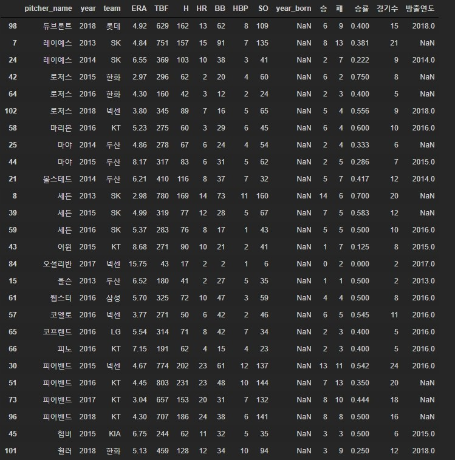

- 2시즌 이상 뛰면서 나중에 방출된 선수들을 보면 승률이 떨어졌고 ERA도 높아졌다.

- 그러면 방출 안 된 선수들의 기록과 비교해보자.

```python
throw_df[throw_df['방출연도'].isnull() == True].reset_index(drop=True).describe()
```

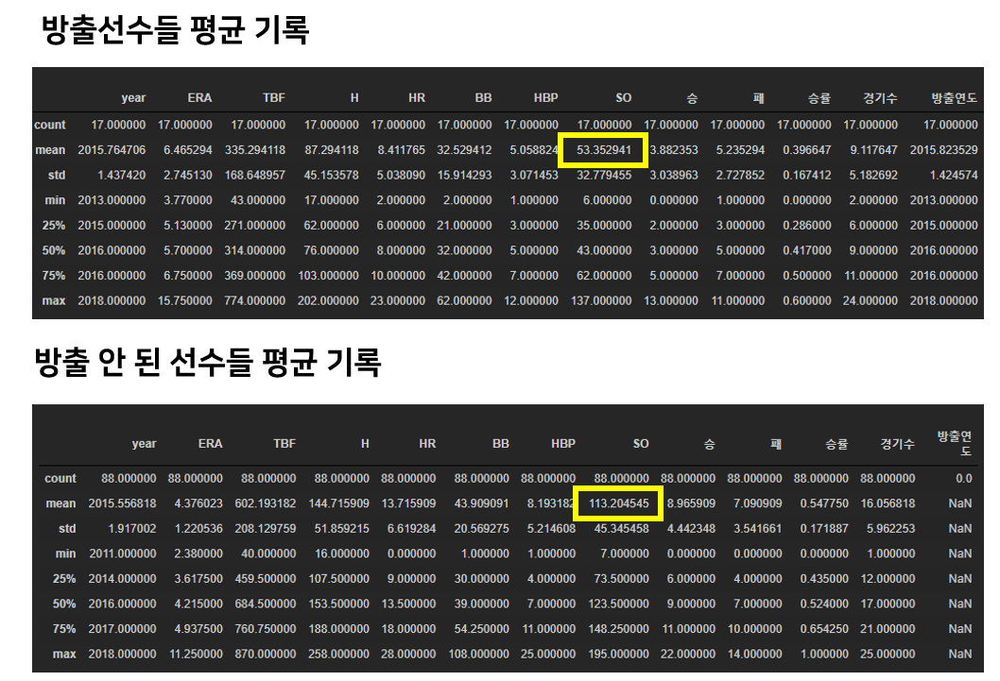

- 확실히 모든 면에서 달랐다. 세이브나 승률 , 승리를 위한 조건들이 방출 안 된 선수들의 기록이 더 좋았다. 세이브는 2배가량 차이가 났다.
- 방출 선수들의 외국기록들과 비교하여 어떤 이유로 스카웃했는데 어떤 기록이 나빠졌는지 꾸준히 뛴 선수들은 어떤 기록이 유지되었는지 보기로  하였다.

```python
외국인메이저성적[외국인메이저성적['pitcher_name'].isin(playername) == True].sort_values(['pitcher_name','year'])
```

### 기록 용어 설명 2

> 위에 없는 것들만 추가하였다.

| 용어이름 | 영문 풀이                                  | 한국용어                   | 설명                                                         |
| -------- | ------------------------------------------ | -------------------------- | ------------------------------------------------------------ |
| WAR      | Wins Above Replacement                     | 대체 선수 대비 승리 기여도 | 선수가 팀 승리에 얼마나 기여했는가를 표현하는 종합적인 성격의 스탯<br>가상의 대체선수와 비교하여 WAR 선수가 득점과 실점 억제에 얼마나 기여했는지를 구하고, 이를 승수로 바꿔 표현 |
| WHIP     | Walks Plus Hits Divided by Innings Pitched | 이닝당 안타 볼넷 허용률    | 피안타 수와 볼넷 수의 합을 투구 이닝으로 나눈 수치           |
| BABIP    | Batting Average on Balls In Play           |                            | [인플레이](https://namu.wiki/w/인플레이)로 이어진 타구에 대한 타율을 계산하는 용어<br>(총 안타수-홈런)/(타수-삼진-홈런+희생플라이) |
| FIP      | Fielding-Independent Pitching              |                            | 수비와 상관 없는 독립된 피칭<br>수비와 관련된 모든 요소를 제외한 순수 기록 |
| LD%      |                                            | 라인 드라이브              |                                                              |
| GB%      |                                            | 땅볼                       |                                                              |
| FB%      |                                            | 플라이볼                   |                                                              |
| IFFB%    | In Field Fly Ball                          | 내야팝업                   | IFFB/FB                                                      |
| SwStr%   |                                            | 헛스윙률                   | 전체 투구 대비 헛스윙 비율<br>스윙 대비 헛스윙 비율과 혼동되서는 안 됨 |
| Swing%   |                                            |                            | 전체 피칭에 대한 타자의 스윙 비율<br>공을 던졌을 때 스윙비율(헛스윙 비율x) |

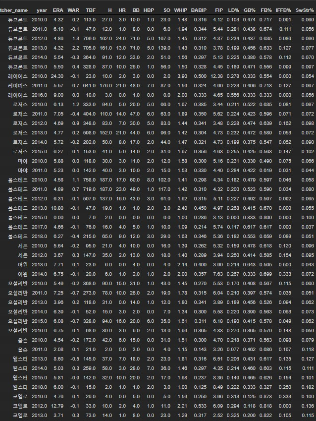

- 이렇게 외국메이저 성적을 보고 어떤 점이 돋보이고 한국이랑 비교해서 어떤 스탯이 감소하였는지 보자.
- 잘던지는 선수가 당연히 모든 팀에 필요하다. 구속과 제구력을 갖추었으면 금상첨화다.

#### 니퍼트 비교해보기

- 메이저성적

```python
외국인메이저성적[(외국인메이저성적['pitcher_name'].isin(playername) ==False)\
 & (외국인메이저성적['pitcher_name'] == '니퍼트')].sort_values(['pitcher_name','year'])
```


- 한국성적

```python
throw_df[throw_df['pitcher_name'] == '니퍼트']
```

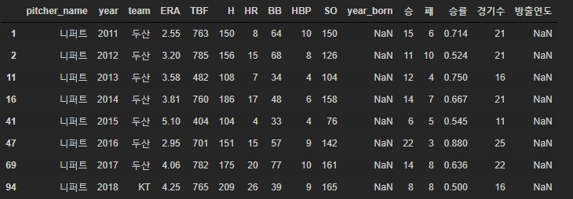

- kbo에 와서 ERA나 SO가 좋아졌다. 
- 메이저 경기수가 없어서 우선 외국인스탯캐스터를 이용해서 경기수를 채워려고 한다. 단순 수치비교보다는 경기수까지 포함해서 보는게 좋을 것 같다. 또한 우승 여부도 넣으면 좋을것 같다.

- 구속이 마일라서 km로 변경하였다.

```python
외국인스탯캐스터['km변환'] = 외국인스탯캐스터['release_speed'].apply(lambda x:round(x*1.609344,0))
```

- 구속이 가장 빠른 투수를 찾아보았다.

```python
외국인스탯캐스터.groupby('pitcher_name',as_index=False).agg({'km변환':'mean'}).sort_values('km변환',ascending=False)
```


- 얼추 들어본 선수들의 이름이 있다. 

- 이쯤에서 궁금해졌다. 과연 감독들은 어떤 투수를 원할까?

  - 6이닝 이상은 던져워서 불펜들을 쉴 수 있게 하는 투수
  - 팀과 융화되는 선수

- [그럼 어떤 외국인 선수들이 살아남았을까?](http://www.kbreport.com/statBuzz/detail?seq=7057&contentsType=a102)

  - 구속이 빠르다고 좋은게 아니다. 구위, 구종까지 갖추어야 살아남는다.

  - 장타보다는 단타

  - 높은 릴리즈 포인트

  - 본인의 장점을 적절히 섞고 안 되는건 고치고 다음해에 다른 무기를 장착해온 선수

  - 위닝샷이라고 불리는 결정구를 가진 선수

  - 커맨드를 겸비한 투수

    - 커맨드란 좋은 스트라이크(good strike) 또는 경우에 따라 존 바깥의 원하는 곳으로 원하는 구질의 공을 던지는 능력

      출처: https://baseball-in-play.com/52 [Baseball-in-Play]

- 그럼 구종이 다양하면서 단타 비율이 높고 키가 크면서 결정구를 가지고 커맨드가 좋은 선수를 뽑으면 되겠다.
  - 그동안에 방출안된 선수들의 기록을 살펴보자.
  - BABIP이 낮고, WAR이 높고, SwStr과 Swing이 높고 GB,FB,IFFB도 높은 순으로 찾아봐야겠다. 거기에 구종의 개수를 추가하자.
    - 물론 세이브와 안타, 홈런, ERA도 고려해야 한다.
  - kbo타자들이 어떤 공에 취약한지 찾아보고 그 공을 자주 던지는 선수를 찾아보자.

```python
외국인스탯캐스터.groupby(['pitcher_name','pitch_name']).agg({'pitch_name':'count'})
```

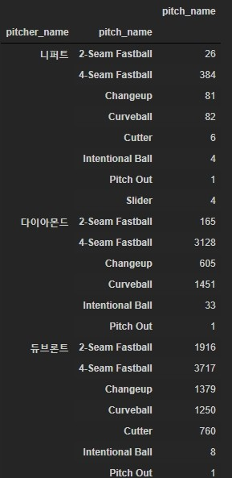

- 이렇게 그동안의 구종을 종합해보았다. 

```python
외국인스탯캐스터.groupby(['pitcher_name','pitch_name']).agg({'pitch_name':'count'}).T['휠러']
```


- 2018년에 방출된 휠러선수의 기록이다. 확실히 다른 선수들보다 pitch가 적다. 이렇게 선수들의 기록을 딕셔너리 형식으로 담아서 컬럼에 저장하려고 한다.

#### df로 저장하기

- 일반선수와 방출되지 않은 선수들의 정보를 df로 만들었다.

```python
mlb_data = pd.DataFrame({'pitcher_name':[], '2-Seam Fastball':[],'4-Seam Fastball':[],'Changeup':[],'Curveball':[],
                        'Cutter':[],'Intentional Ball':[],'Pitch Out':[],'Slider':[]})
for name in playername:
    a = 외국인스탯캐스터.groupby(['pitcher_name','pitch_name']).agg({'pitch_name':'count'})\
.T[name].reset_index(drop=True)
    a['pitcher_name'],a['cnt'] = name, a.shape[1]
    mlb_data = mlb_data.append(a,ignore_index=True)
mlb_data 
```

- 빈 df를 만들어서 계속 붙여나갔다.

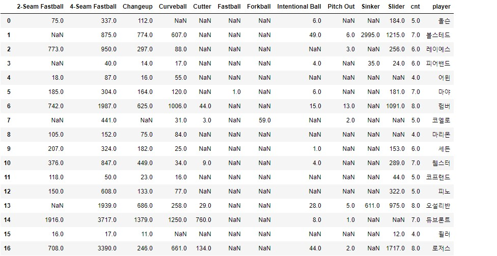

- 방출되지 않은 선수 df

```python
not_out = list(filter(lambda x:x not in playername,list(throw_df.drop_duplicates(['pitcher_name'])['pitcher_name'])))

mlb_data_2 = pd.DataFrame({'pitcher_name':[], '2-Seam Fastball':[],'4-Seam Fastball':[],'Changeup':[],'Curveball':[],
                        'Cutter':[],'Intentional Ball':[],'Pitch Out':[],'Slider':[]})
for name in not_out:
    a = 외국인스탯캐스터.groupby(['pitcher_name','pitch_name']).agg({'pitch_name':'count'})\
.T[name].reset_index(drop=True)
    a['pitcher_name'],a['cnt'] = name, a.shape[1]
    mlb_data_2 = mlb_data.append(a,ignore_index=True)
mlb_data_2    
```

- 그러나 다음과 같은 에러가 발생하였다.

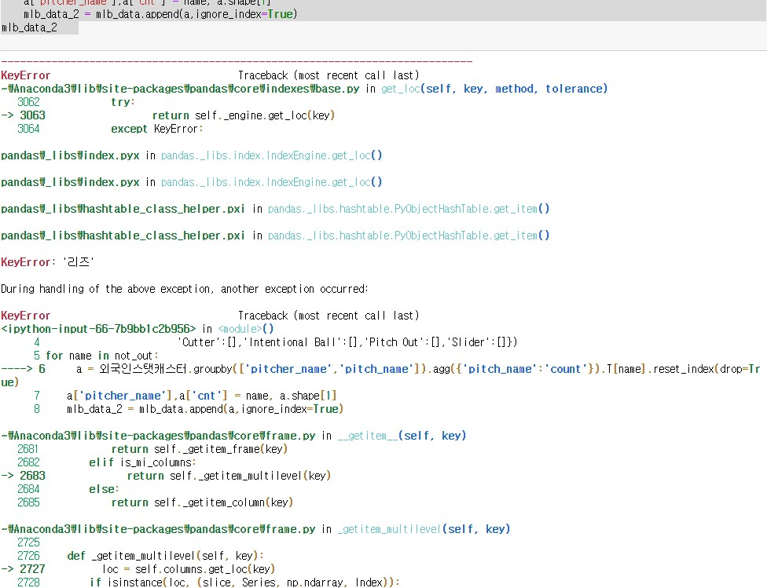

- 외국인스탯캐스터에 정보가 없는 선수들이 있었다.
- 그래서 try와 except를 하였다.

```python
not_out = list(filter(lambda x:x not in playername,list(throw_df.drop_duplicates(['pitcher_name'])['pitcher_name'])))

mlb_data_2 = pd.DataFrame({'pitcher_name':[], '2-Seam Fastball':[],'4-Seam Fastball':[],'Changeup':[],'Curveball':[],
                        'Cutter':[],'Intentional Ball':[],'Pitch Out':[],'Slider':[]})
for name in not_out:
    try:
        a = 외국인스탯캐스터.groupby(['pitcher_name','pitch_name']).agg({'pitch_name':'count'})\
    .T[name].reset_index(drop=True)
        a['pitcher_name'],a['cnt'] = name, a.shape[1]
        mlb_data_2 = mlb_data_2.append(a,ignore_index=True)
    except:
        print(name)
mlb_data_2  
```

- 리즈와 카스티요선수만 없었다.

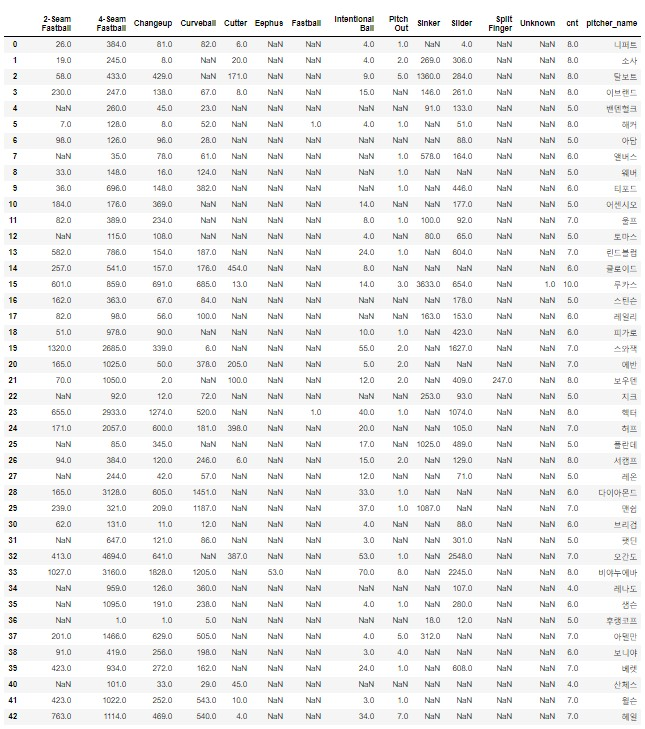

- 7~8개를 가진 선수들이  많다.

- 이 정보와 함께 x,y축을 이용한 캐글 코드를 사용하려고 한다. [출처](https://www.kaggle.com/jzdsml/sp-finding-baseball-strike-zone-w-svm)

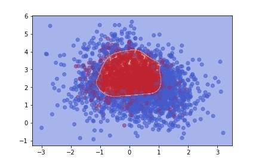

- 이렇게 스트라이크 존을 예측해준다. 따라해보자.

```python
def plot_SVM(aaron_judge,gamma=1, C=1):
#     aaron_judge = pd.read_csv('../input/aaron_judge.csv')
    #print(aaron_judge.columns)
    #print(aaron_judge.description.unique())
    #print(aaron_judge.type.unique())
    aaron_judge.type = aaron_judge.type.map({'S':1, 'B':0})
    #print(aaron_judge.type)
    #print(aaron_judge['plate_x'])
    aaron_judge = aaron_judge.dropna(subset = ['type', 'plate_x', 'plate_z'])
    fig, ax = plt.subplots()
    plt.scatter(aaron_judge.plate_x, aaron_judge.plate_z, c = aaron_judge.type, cmap = plt.cm.coolwarm, alpha=0.6)
    training_set, validation_set = train_test_split(aaron_judge, random_state=1)
    classifier = SVC(kernel='rbf', gamma = gamma, C = C)
    classifier.fit(training_set[['plate_x', 'plate_z']], training_set['type'])
    draw_boundary(ax, classifier)
    plt.show()
    print("The score of SVM with gamma={0} and C={1} is:".format(gamma, C) )
    print(classifier.score(validation_set[['plate_x', 'plate_z']], validation_set['type']))
```

- ` aaron_judge.type = aaron_judge.type.map({'S':1, 'B':0})` 여기를 보면 스트라이크와 볼이 다른 값을 가져야 한다. 그래서 밑에 사진과 같이 같은 타자에게 누적된 값을 분리해줘야 하는 작업이 필요하다.


### ball, strike를 입력하기

```python
외국인스탯캐스터_ball = 외국인스탯캐스터.sort_values(by=['game_date','pitcher','batter','balls']).reset_index(drop=True)
외국인스탯캐스터_strikes = 외국인스탯캐스터.sort_values(by=['game_date','pitcher','batter','strikes']).reset_index(drop=True)
외국인스탯캐스터.head()
```

- 볼로 정렬한것과 스트라이크로 정렬한거 2개 df를 만들기

```python
for i in range(1,외국인스탯캐스터_ball.shape[0]):
    if 외국인스탯캐스터_ball.loc[i-1,'batter'] == 외국인스탯캐스터_ball.loc[i,'batter'] and\
 외국인스탯캐스터_ball.loc[i-1,'pitcher'] == 외국인스탯캐스터_ball.loc[i,'pitcher']:
        
        ball_cnt = 외국인스탯캐스터.loc[i,'balls']  - 외국인스탯캐스터.loc[i-1,'balls']
        print(f'ball_cnt, : {ball_cnt}')
```

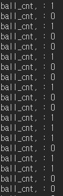

- 이렇게 볼과 스트라이크를 새로운 컬럼으로 만들어보자.