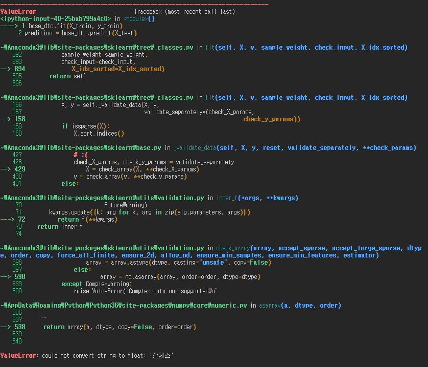

# 데이콘 - KBO 외국인 투수 스카우팅 최적화 경진대회 [연습]_03

### strike와 ball 분리하기

```python
from tqdm import tqdm

for i in tqdm(range(외국인스탯캐스터.shape[0])):
    if 외국인스탯캐스터.loc[i,'description'].split('_')[-1] in ['strike','foul']:
        외국인스탯캐스터.loc[i,'type'] = 'S'
    elif 외국인스탯캐스터.loc[i,'description'].split('_')[-1] in ['ball']:
        외국인스탯캐스터.loc[i,'type'] = 'B'
    else:
        외국인스탯캐스터.loc[i,'type'] = 'N'

```


- description에 나와있는 설명을 기준으로 strike와 foul은 strike로 ball은 ball로 분리하고 두가지 모두 아니면 출루, 득점, 아웃이기때문에 우선은 제외하였다. rmse가 낮으면 스트라이크로 추가해서 다시 돌려본다. 우선은 제외하고 진행한다.


- 이렇게 만든다.

```python
외국인스탯캐스터_index = list(외국인스탯캐스터[외국인스탯캐스터['type'] == 'N'].index)
외국인스탯캐스터_index
외국인스탯캐스터_filter = 외국인스탯캐스터.drop(외국인스탯캐스터_index).reset_index(drop=True)
외국인스탯캐스터_filter
```

- N인 것들은 우선 제외하고 다시 df를 만든다.

### 캐글에 나와있는 스타라이크 존 SVM 해보기[https://www.kaggle.com/jzdsml/sp-finding-baseball-strike-zone-w-svm]

```python
def make_meshgrid(ax, h=.02):
    x_min, x_max = ax.get_xlim()
    y_min, y_max = ax.get_ylim()

    xx, yy = np.meshgrid(np.arange(x_min, x_max, h),
                         np.arange(y_min, y_max, h))
    return xx, yy

def plot_contours(ax, clf, xx, yy, **params):
    Z = clf.predict(np.c_[xx.ravel(), yy.ravel()])
    Z = Z.reshape(xx.shape)
    out = ax.contourf(xx, yy, Z, **params)
    return out


def draw_boundary(ax, clf):

    xx, yy = make_meshgrid(ax)
    return plot_contours(ax, clf, xx, yy,cmap=plt.cm.coolwarm, alpha=0.5)
```

```python
from sklearn.svm import SVC
from sklearn.model_selection import train_test_split

def plot_SVM(aaron_judge,gamma=1, C=1):
    aaron_judge.type = aaron_judge.type.map({'S':1, 'B':0})
    fig, ax = plt.subplots()
    plt.scatter(aaron_judge.plate_x, aaron_judge.plate_z, c = aaron_judge.type, cmap = plt.cm.coolwarm, alpha=0.6)
    training_set, validation_set = train_test_split(aaron_judge, random_state=1)
    classifier = SVC(kernel='rbf', gamma = gamma, C = C)
    classifier.fit(training_set[['plate_x', 'plate_z']], training_set['type'])
    draw_boundary(ax, classifier)
    plt.show()
    print("The score of SVM with gamma={0} and C={1} is:".format(gamma, C) )
    print(classifier.score(validation_set[['plate_x', 'plate_z']], validation_set['type']))
```


- 표본이 적어서 그런지 엄청나게 잘 예측하였다.

#### [svc가 무엇인지, 매게변수가 어떤의미를 가지는지 알아보기](https://bskyvision.com/163)

- 출처 : https://bskyvision.com/163

```
SVC(kernel='rbf', gamma = gamma, C = C)
```

- svm은 데이터를 선형으로 분리하는 최적의 선형 결정 경계를 찾는 알고리즘
- c는 이상치의 정도를 설정한다. c를 높일수록 이상치를 엄격하게 관리하는 것이고 c가 낮을수록 이상치의 허용에 관대하다.
- c가 너무 낮으면 과소적합, c가 너무 높으면 과대적합이 될 가능성이 커진다.

- 선형 svm으로 한계가 있어서 3차원으로 보고 경계를 짓는 rbf 커널 svm이 나왔다.
  - 그래서 커널을 rbf로 지정해주었다.

- 감마가 클수록 작은 표준편차를 가진다.
  - 데이터 포인터가 영향력을 행사하는 거리가 짧아진다.

### 선수별로 SVM은 나중에 구해보고 원래대로 한국에서 경기수와 승률 상위 20%와 하위 20%의 스탯을 뽑아 승패를 학습하기

```python
throw_df = pd.read_csv('률lus_win_lose_2.csv')
top20 = throw_df.sort_values(['승률','경기수'], ascending=False).reset_index(drop=True)[:20]
bottom20 = throw_df.sort_values(['승률','경기수'], ascending=False).reset_index(drop=True)[-20:]
display(top20)
display(bottom20)
```

- 단순히 승률로만 본다면 1경기 뛰고 이기면 100%여서 경기수도 같이 보았다.


- 상위 20명이여서 그런지 방출도 없다.

- 익숙한 이름들이 많다.


- 방출된 사람들도 보이고 방어율이 안좋다.

### 머신러닝

```python
from sklearn.tree import DecisionTreeClassifier
from sklearn.model_selection import train_test_split
```

- 사이킷런을 불러서 머신런닝하기

```python
feature = throw_df.drop('승',axis=1)
label = throw_df['승']

X_train, X_test, y_train, y_test = train_test_split(feature,label, test_size = 0.2, random_state=20)
```

- 승을 기준으로 피처와 라벨을 나워서 학습과 테스트 테이터를 나눈다.

```python
base_dtc = DecisionTreeClassifier(random_state=20, criterion='entropy')
base_dtc.fit(X_train, y_train)
predition = base_dtc.predict(X_test)
```

- 우선은 의사결정나무로 학습해보기로 하였다. 



- 라벨링을 안해서 오류가 발생하였다. 선수이름과 팀, 승을 라벨링해서 다시 나누자.